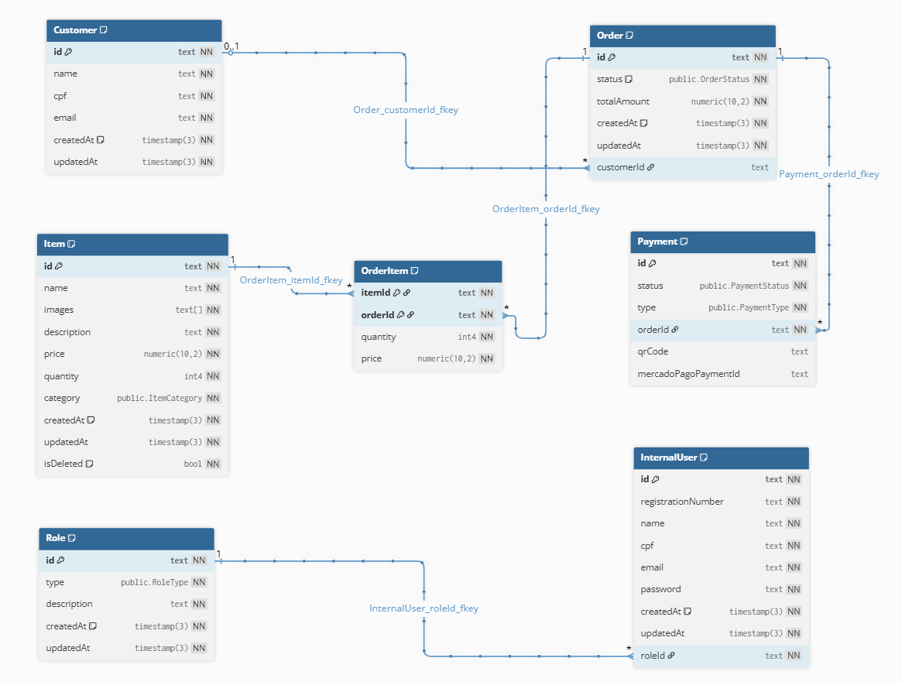

# 🗃️ Documentação do Banco de Dados - TC2-G38

## 📋 Índice
- [Visão Geral](#visão-geral)
- [Por que PostgreSQL?](#por-que-postgresql)
- [Modelagem do Banco](#modelagem-do-banco)
- [DDL - Data Definition Language](#ddl---data-definition-language)
- [Formas Normais](#formas-normais)
- [Estrutura das Tabelas](#estrutura-das-tabelas)
- [Índices e Performance](#índices-e-performance)

## 🎯 Visão Geral

Este documento apresenta a modelagem e estrutura do banco de dados desenvolvido para o sistema de lanchonete do Tech Challenge 2 - Grupo 38 da FIAP. O banco foi projetado seguindo as melhores práticas de normalização e otimização para garantir integridade, performance e escalabilidade.


## 🐘 Por que PostgreSQL?

### ✅ Confiabilidade e Estabilidade
O PostgreSQL é reconhecido por sua robustez e estabilidade, garantindo a integridade dos dados mesmo em cenários de falha. Isso é fundamental para aplicações comerciais onde a perda de transações é inaceitável.

### ✅ Riqueza de Recursos
- Suporte nativo a **JSON/JSONB**
- **Arrays** como tipo de dados nativo
- **Enums** personalizados
- **Buscas textuais avançadas**
- **Índices especializados** (B-tree, GIN, GiST, etc.)

### ✅ Integração com Prisma
O PostgreSQL possui suporte excelente no Prisma ORM, oferecendo:
- Mapeamento de dados tipado e seguro
- Redução de código repetitivo
- Facilita a evolução e manutenção da aplicação
- Migrações automáticas e versionadas

### ✅ Containerização e DevOps
- Integração perfeita com Docker
- Imagens oficiais bem mantidas
- Ambientes consistentes entre desenvolvimento, teste e produção
- Configuração simplificada

### ✅ Escalabilidade
- Suporte a milhões de registros
- Queries paralelas
- Diversos tipos de índices para otimização
- Planejamento de crescimento a longo prazo

### ✅ Open Source
- Gratuito com qualidade empresarial
- Comunidade ativa e suporte contínuo
- Sem custos de licenciamento

## 📊 Modelagem do Banco

O banco de dados foi modelado seguindo o padrão de **Clean Architecture**, com separação clara entre entidades de domínio e infraestrutura de dados.



### 🔗 Relacionamentos Principais

```
Customer (1) -----> (N) Order
Order (1) --------> (1) Payment
Order (1) -----> (N) OrderItem
Item (1) ------> (N) OrderItem
InternalUser (N) -> (1) Role
```

## 🏗️ DDL - Data Definition Language

### 📁 Tipos Enumerados (ENUM)

```sql
-- Status dos Pedidos
CREATE TYPE public."OrderStatus" AS ENUM (
    'RECEIVED', 'PREPARING', 'READY', 
    'COMPLETED', 'PENDING', 'CANCELLED'
);

-- Categorias dos Itens
CREATE TYPE public."ItemCategory" AS ENUM (
    'SANDWICH', 'BEVERAGE', 'SIDE', 'DESSERT'
);

-- Status dos Pagamentos
CREATE TYPE public."PaymentStatus" AS ENUM (
    'APPROVED', 'PENDING', 'REFUSED', 
    'EXPIRED', 'CANCELLED'
);

-- Tipos de Pagamento
CREATE TYPE public."PaymentType" AS ENUM (
    'PIX', 'CREDIT_CARD', 'DEBIT_CARD'
);

-- Tipos de Perfil user internal
CREATE TYPE public."RoleType" AS ENUM (
    'ADMIN', 'STAFF'
);
```

### 🗂️ Estrutura das Tabelas

#### 👤 Customer - Clientes
```sql
CREATE TABLE public."Customer" (
    id text NOT NULL,
    name text NOT NULL,
    cpf text NOT NULL,
    email text NOT NULL,
    createdAt timestamp(3) DEFAULT CURRENT_TIMESTAMP NOT NULL,
    updatedAt timestamp(3) NOT NULL,
    CONSTRAINT "Customer_pkey" PRIMARY KEY (id)
);

CREATE UNIQUE INDEX "Customer_cpf_key" ON public."Customer" USING btree (cpf);
CREATE UNIQUE INDEX "Customer_email_key" ON public."Customer" USING btree (email);
```

#### 🍔 Item - Produtos do Cardápio
```sql
CREATE TABLE public."Item" (
    id text NOT NULL,
    name text NOT NULL,
    images text[] NOT NULL,
    description text NOT NULL,
    price numeric(10, 2) NOT NULL,
    quantity int4 NOT NULL,
    category public."ItemCategory" NOT NULL,
    createdAt timestamp(3) DEFAULT CURRENT_TIMESTAMP NOT NULL,
    updatedAt timestamp(3) NOT NULL,
    isDeleted bool DEFAULT false NOT NULL,
    CONSTRAINT "Item_pkey" PRIMARY KEY (id)
);

CREATE INDEX idx_item_category_active 
ON public."Item" USING btree (category) 
WHERE ("isDeleted" = false);

CREATE INDEX idx_item_category_status 
ON public."Item" USING btree (category, "isDeleted");
```

#### 📋 Order - Pedidos
```sql
CREATE TABLE public."Order" (
    id text NOT NULL,
    status public."OrderStatus" DEFAULT 'RECEIVED' NOT NULL,
    totalAmount numeric(10, 2) NOT NULL,
    createdAt timestamp(3) DEFAULT CURRENT_TIMESTAMP NOT NULL,
    updatedAt timestamp(3) NOT NULL,
    customerId text NULL,
    CONSTRAINT "Order_pkey" PRIMARY KEY (id),
    CONSTRAINT "Order_customerId_fkey" 
        FOREIGN KEY ("customerId") 
        REFERENCES public."Customer"(id) 
        ON DELETE SET NULL ON UPDATE CASCADE
);

CREATE INDEX idx_order_customerid ON public."Order" USING btree ("customerId");
CREATE INDEX idx_order_status ON public."Order" USING btree (status);
```

#### 🛒 OrderItem - Itens do Pedido
```sql
CREATE TABLE public."OrderItem" (
    itemId text NOT NULL,
    orderId text NOT NULL,
    quantity int4 NOT NULL,
    price numeric(10, 2) NOT NULL,
    CONSTRAINT "OrderItem_pkey" PRIMARY KEY ("itemId", "orderId"),
    CONSTRAINT "OrderItem_itemId_fkey" 
        FOREIGN KEY ("itemId") 
        REFERENCES public."Item"(id) 
        ON DELETE RESTRICT ON UPDATE CASCADE,
    CONSTRAINT "OrderItem_orderId_fkey" 
        FOREIGN KEY ("orderId") 
        REFERENCES public."Order"(id) 
        ON DELETE RESTRICT ON UPDATE CASCADE
);

CREATE INDEX idx_orderitem_orderid ON public."OrderItem" USING btree ("orderId");
```

#### 💳 Payment - Pagamentos
```sql
CREATE TABLE public."Payment" (
    id text NOT NULL,
    status public."PaymentStatus" NOT NULL,
    type public."PaymentType" NOT NULL,
    orderId text UNIQUE NOT NULL,
    qrCode text NULL,
    mercadoPagoPaymentId text NULL,
    CONSTRAINT "Payment_pkey" PRIMARY KEY (id),
    CONSTRAINT "Payment_orderId_fkey" 
        FOREIGN KEY ("orderId") 
        REFERENCES public."Order"(id) 
        ON DELETE RESTRICT ON UPDATE CASCADE
);

CREATE UNIQUE INDEX "Payment_orderId_key" ON public."Payment" USING btree ("orderId");
CREATE INDEX idx_payment_status ON public."Payment" USING btree (status);
```

#### 👨‍💼 Role - Perfis de Usuário
```sql
CREATE TABLE public."Role" (
    id text NOT NULL,
    type public."RoleType" NOT NULL,
    description text NOT NULL,
    createdAt timestamp(3) DEFAULT CURRENT_TIMESTAMP NOT NULL,
    updatedAt timestamp(3) NOT NULL,
    CONSTRAINT "Role_pkey" PRIMARY KEY (id)
);

CREATE INDEX idx_role_type ON public."Role" USING btree (type);
```

#### 👥 InternalUser - Usuários Internos
```sql
CREATE TABLE public."InternalUser" (
    id text NOT NULL,
    registrationNumber text NOT NULL,
    name text NOT NULL,
    cpf text NOT NULL,
    email text NOT NULL,
    password text NOT NULL,
    createdAt timestamp(3) DEFAULT CURRENT_TIMESTAMP NOT NULL,
    updatedAt timestamp(3) NOT NULL,
    roleId text NOT NULL,
    CONSTRAINT "InternalUser_pkey" PRIMARY KEY (id),
    CONSTRAINT "InternalUser_roleId_fkey" 
        FOREIGN KEY ("roleId") 
        REFERENCES public."Role"(id) 
        ON DELETE RESTRICT ON UPDATE CASCADE
);

CREATE UNIQUE INDEX "InternalUser_registrationNumber_key" 
ON public."InternalUser" USING btree ("registrationNumber");

CREATE UNIQUE INDEX "InternalUser_cpf_key" 
ON public."InternalUser" USING btree (cpf);

CREATE UNIQUE INDEX "InternalUser_email_key" 
ON public."InternalUser" USING btree (email);

CREATE INDEX idx_internaluser_roleid 
ON public."InternalUser" USING btree ("roleId");
```

## 📏 Formas Normais

O banco de dados foi projetado seguindo rigorosamente as três primeiras formas normais:

### 1️⃣ Primeira Forma Normal (1FN)

**✅ Valores Atômicos**: Cada campo contém um valor único e indivisível.
- **Exemplo**: A coluna `images` na tabela `Item` utiliza o tipo `text[]` (array), que o PostgreSQL trata como um tipo atômico único.

**✅ Identificadores Únicos**: Todas as tabelas possuem chave primária.
- **Implementação**: Campo `id` do tipo `text` com UUID em todas as entidades.

### 2️⃣ Segunda Forma Normal (2FN)

**✅ Dependência Funcional Completa**: Aplicável principalmente à tabela `OrderItem` que possui chave primária composta.

**Análise da tabela OrderItem**:
- **Chave Primária**: `(itemId, orderId)`
- **quantity**: Depende da chave completa (quantidade específica de um item em um pedido)
- **price**: Depende da chave completa (preço do item no momento daquele pedido específico)

### 3️⃣ Terceira Forma Normal (3FN)

**✅ Eliminação de Dependências Transitivas**: Campos não-chave dependem apenas da chave primária.

**Exemplo - Tabela Customer**:
- `name`, `cpf`, `email` dependem diretamente de `id`
- `name` não depende de `email`
- `cpf` não depende de `name`
- Não há dependências transitivas entre campos não-chave

## 🚀 Índices e Performance

### 📈 Estratégia de Indexação

#### Índices Automáticos (Prisma)
- **Primary Keys**: Todas as chaves primárias
- **Unique Constraints**: CPF, email, registrationNumber
- **Foreign Keys**: Relacionamentos entre tabelas

#### Índices de Performance
- **idx_item_category_active**: Consultas de itens por categoria (apenas ativos)
- **idx_order_status**: Filtragem de pedidos por status
- **idx_payment_status**: Consultas de pagamentos por status
- **idx_role_type**: Busca por tipo de perfil

#### Índices Condicionais
```sql
-- Otimização para itens ativos
CREATE INDEX idx_item_category_active 
ON public."Item" USING btree (category) 
WHERE ("isDeleted" = false);
```

### 🎯 Benefícios da Estratégia

1. **Consultas Otimizadas**: Redução significativa no tempo de resposta
2. **Economia de Espaço**: Índices condicionais indexam apenas dados relevantes
3. **Escalabilidade**: Preparado para crescimento da base de dados
4. **Manutenção**: Prisma gerencia automaticamente os índices básicos

## 📈 Considerações de Performance

- **Soft Delete**: Implementação de exclusão lógica para auditoria
- **Audit Trail**: Campos `createdAt` e `updatedAt` para rastreabilidade
- **Tipos Otimizados**: Uso de `numeric(10,2)` para valores monetários
- **Arrays Nativos**: Aproveitamento dos recursos nativos do PostgreSQL

